# API Connect hands-on

## Overview

IBM API Connect is a comprehensive end-to-end API lifecycle solution.
APIs are created within the developer toolkit. The developer toolkit includes a CLI and API Designer graphical user interface. To access the developer toolkit, you need to download and install it from npm. When you install the toolkit, you begin by creating a LoopBack project \
• ```LoopBack project```: The LoopBack project contains the LoopBack application and API Product \
• ```LoopBack application```: Within the Loopback application is the API endpoint that provides access to your data source, business asset, or cloud service \
•	```Product```: The Product is the unit that enables you to publish your APIs. A Product contains a Plan and a Plan contains the API that invokes the API endpoint when it is called.


## Items to be covered:
1.	Create a new LoopBack project.
2.	Add a new data source and model to a LoopBack project using the API Designer in the IBM® API Connect for IBM Cloud toolkit.

Pre-requisites:
1.	An IBM Cloud account with Organization and Spaces created within account.
2.	Install Node.js and npm
3.	Before you begin, install the API Connect toolkit.


## [Steps to register for IBM Cloud](https://github.com/rachana5198/APP-Connect-handson#steps-to-register-for-ibm-cloud)

Go to [IBM Cloud](https://cloud.ibm.com/login)
If you are a existing user, login using your credentials. If you are new user, register for IBM cloud and login.
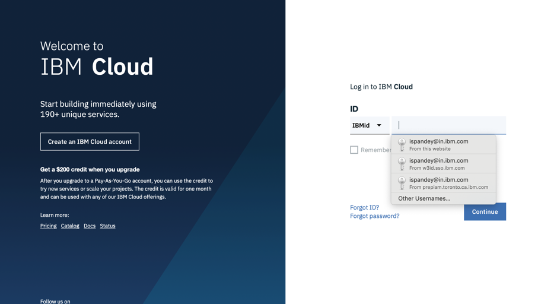

## Steps to install NODE.JS
1) Download and install node.js from one of the two sources:
https://nodejs.org/en/download/ (Note: Download the LTS version for your platform, not the latest, or you might experience errors.) OR o https://developer.ibm.com/node/sdk/v6/

Installing node.js also installs npm (Node Package Manager).

2) Once Node.js is downloaded and install, check to make sure it is in your PATH.

3) Update npm. In a command line, enter npm install -g npm
Check the installed version and path.
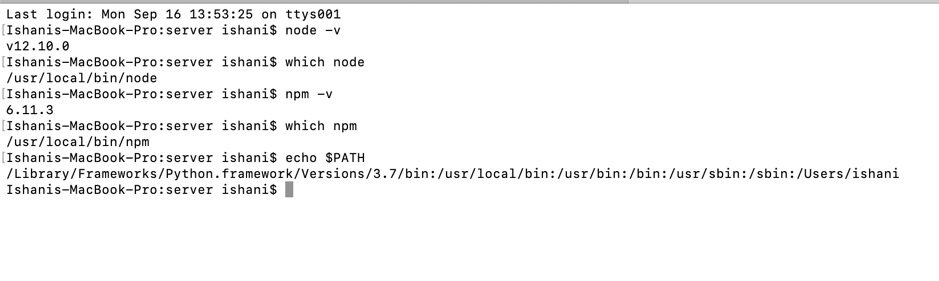

## Install the API CONNECT TOOLKIT
1) Update the npm config to allow use of untrusted certificates.
npm config -g set strict-ssl false

2) Install the API Connect toolkit from npm.
npm install -g apiconnect

3) Check the installed version.
apic -v

4) Enter the following command on the command line: npm install -g microgateway
We will use the Microgateway as a local test server.

Here we should have successfully installed the IBM API Connect.
Once the toolkit is installed,You can verify this by entering the following command on the command-line:

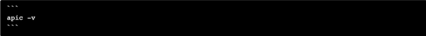

## Let us now move to the objective of this hands on.

## CREATE A LOOPBACK PROJECT
To create a LoopBack project using the API Connect toolkit command line, complete the following steps:
1) From the command-line interface, enter the following commands. It is used to create and manage LoopBack applications.


For this session we will create a project called ```weather-data```
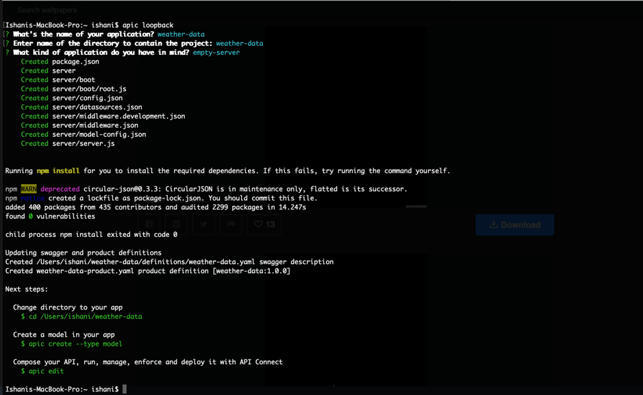

This process creates a node_modules directory and might take some time.
An empty LoopBack project contains the following directories:
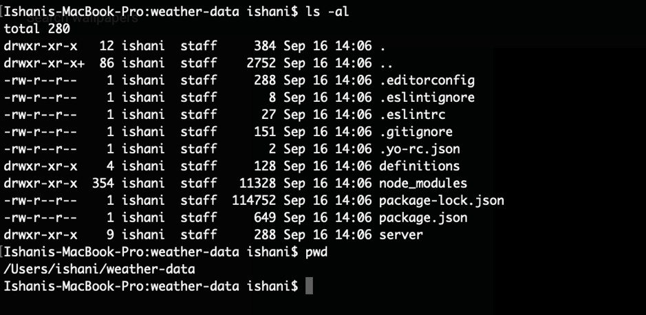

## ADD A NEW DATA SOURCE AND MODEL
To add a new model and data source to a LoopBack project using the API Designer, complete the following steps:

## Add a data source
To add a new data source to a LoopBack project using the API Designer, complete the following steps.
1) You must also create a LoopBack project (the "weather-data" project) as described in Create a LoopBack project from the command line and make sure the current working directory is the project root directory
2) From the command line, enter the following command:```apic edit```
After a brief pause, the console displays this message:

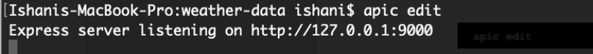
The API Designer opens in your default web browser, initially displaying the login page if you haven't logged in recently.
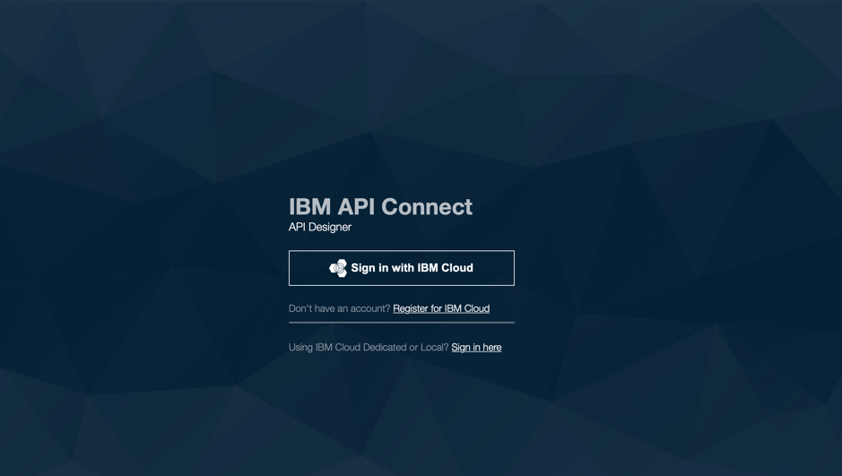

3)Login using your IBM Cloud credentials
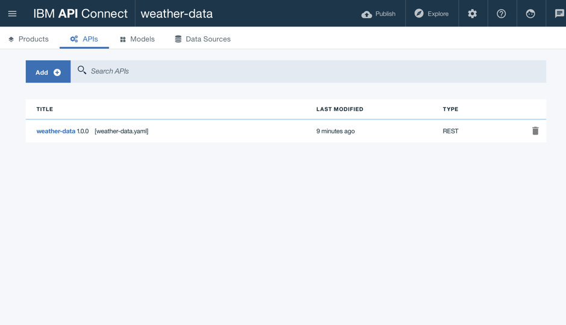

4)Click the Data Sources icon 


5) Click Add. The New LoopBack Data Source window opens.

6) Enter ```weatherDS``` in the Name text field
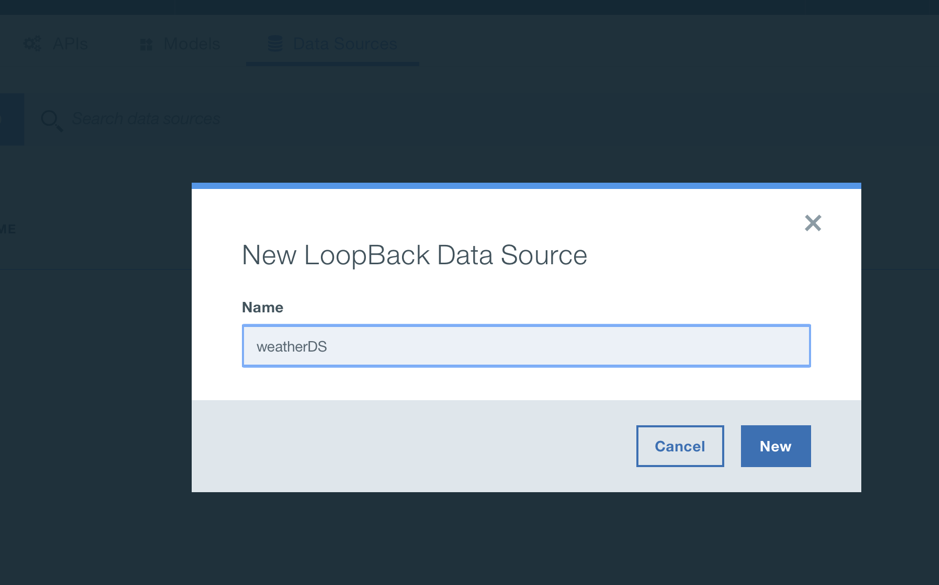

7) Click New

8) By default, the Connector setting shows In-memory db and the other settings are blank. Keep the default settings for now, and API Designer automatically saves the new data source.
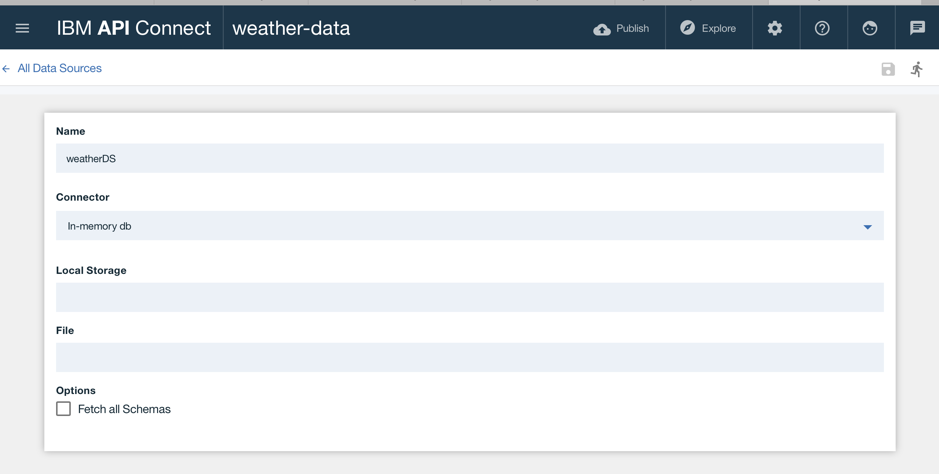

9) Click the Test Connection icon  to test the data source connection. The message "Data source connection test succeeded" is displayed.
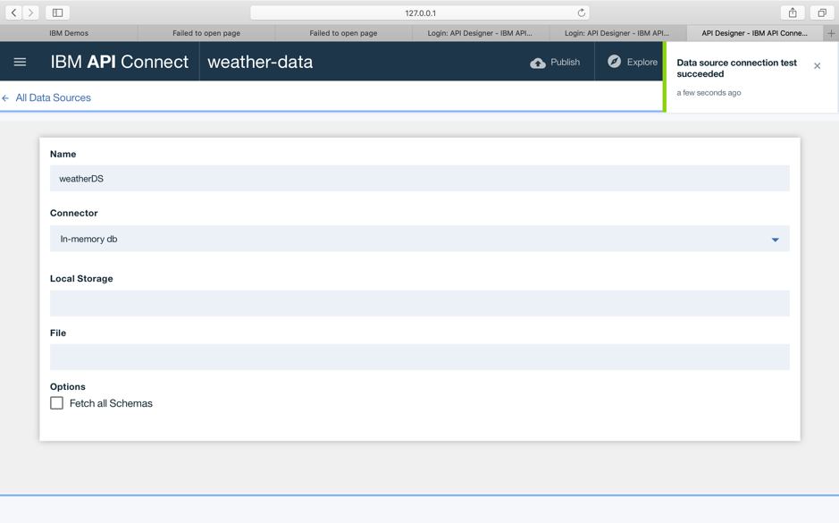

10) Click ```All Data Sources``` The data source will appear in the list of data sources, and the editor updates the server/datasources.json file with settings for the new data source.
 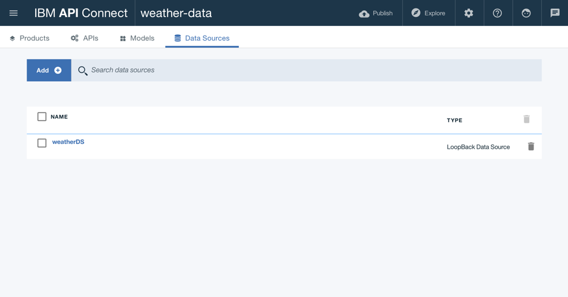

## Add a model
To add a new model to a LoopBack project using the API Designer, complete the following steps:

1) Click the Models icon \
2) Click Add. The New LoopBack Model window opens. \
3) Enter weather in the Name text field, then click New.
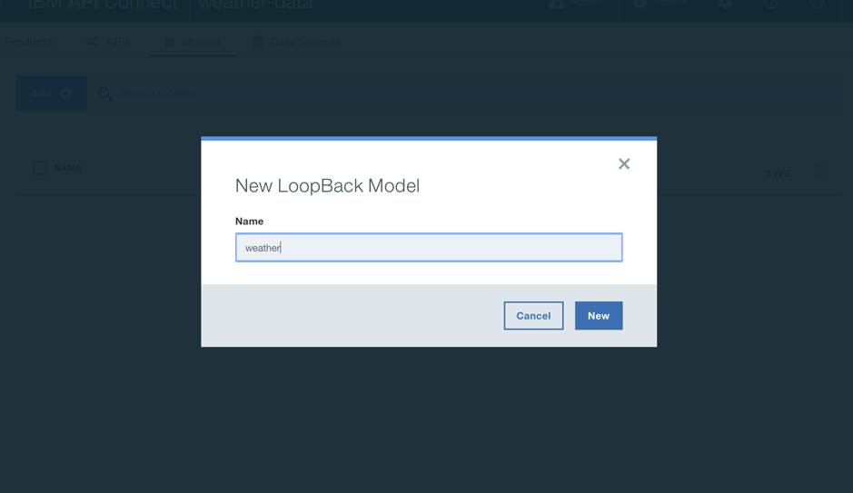
4) In the Data Source field, select ```weatherDS```
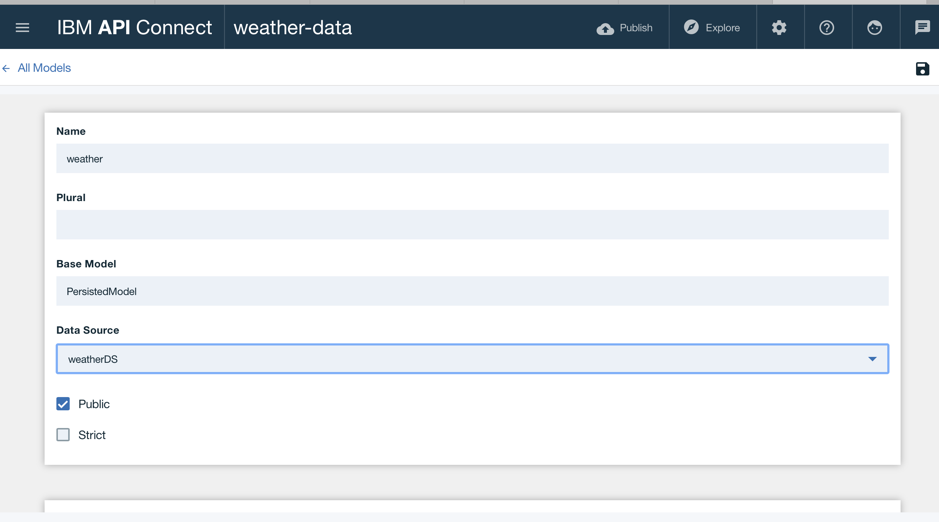
5) In the Properties, click the Add property icon . \
6) In the Property Name text field, enter zip_code. \
7) For Type, select number. \
8) Select Required to make the property required. This means that it must have a value when you add or update a model instance. \
9) Select ID to ensure that the property has a unique identifier. For now, keep the default values for the other settings:
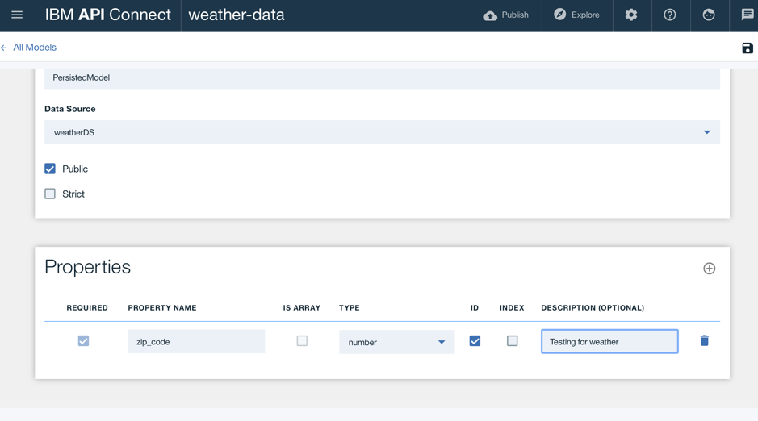

10) Click the Add property icon again to add another property. Reference the table below to complete the remaining properties:
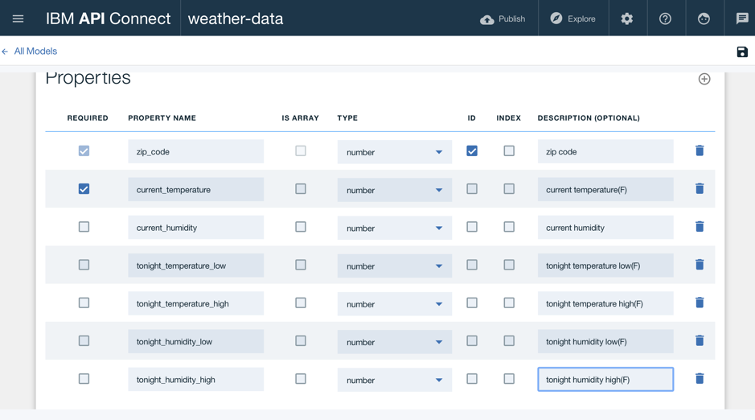

11) Click the Save icon to save your changes

12) Click All Models to finish editing the model

This completes adding a new data source and model to the weather-data LoopBack project

Congratulations, you have completed the lab! You have now learnt how to create a loopback project by adding data source and model.

## Next Steps: Publishing API CONNECT to IBM CLOUD

Please refer to the video below to understand how we can publish the API Connect projects to the IBM Cloud Catalog.

[](https://www.youtube.com/watch?v=U4meXJWV4us)
