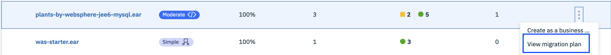

# Modernize Applications using Transformation Advisor Local

## Introduction

The process of modernizing applications and moving to the cloud can be a large undertaking. Careful planning is needed to prepare business inventory and infrastructure and to determine the best path forward for each application. If you don't yet have a cloud platform but are ready to begin the assessment for your modernization journey, this lab can help you get started.

The IBM Transformation Advisor Local (Beta) is a tool that quickly evaluates your on-premises applications for rapid deployment on WebSphere Application Server and Liberty on public or private cloud environments.

Transformation Advisor supports legacy applications running on the following platforms:

* WebSphere Application Server
* JBoss AS
* Oracle Web Logic
* Apache Tomcat
* Plain Old Java Objects running in a JVM

## Pre-requisite

1) Before you can install IBM Cloud™ Transformation Advisor Local (Beta), go to the Registration and download site to download the files and accept license terms. [https://www.ibm.com/account/reg/in-en/signup?formid=urx-38642](https://www.ibm.com/account/reg/in-en/signup?formid=urx-38642)

2) Then, make sure that you meet the prerequisites for your operating system and follow the installation instructions.
Docker Desktop or Docker Toolbox is required to run Transformation Advisor locally on Windows. For Linux and MacOS you need Docker and Docker Compose.

### Installation on Linux/MacOS

This task covers how to install IBM Transformation Advisor locally on Linux or MacOS. Before you start, ensure that the following products are installed:

#### Pre-requisite on Linux/MacOS

* Docker: [https://docs.docker.com/docker-for-mac/install/](https://docs.docker.com/docker-for-mac/install/)

[https://docs.docker.com/install/linux/docker-ce/ubuntu/#install-docker-engine---community-1](https://docs.docker.com/install/linux/docker-ce/ubuntu/#install-docker-engine---community-1)
  
* Docker Compose: [https://docs.docker.com/compose/install/](https://docs.docker.com/compose/install/)

#### Get started with Transformation Advisor installation on Linux/MacOS 

1) Create a directory for the Transformation Advisor files, for example, ta_local. Copy the .zip file that you downloaded during the registration step into this directory and extract it: 
unzip transformationAdvisor.zip

2) To install Transformation Advisor locally, run the following command: 
./launchTransformationAdvisor.sh

3) Select 1 if you agree with the terms of the License.

4) Select 1 to install Transformation Advisor.

5) After the installation is complete, you can access Transformation Advisor locally at the following URLs. The host name or IP address and port are provided by the installation program.

Linux: http://< host name >:< port >

MacOS: http://< IP Address >:< port > 

### For Windows:

Watch this video to install on windows:
https://youtu.be/45xiAUDhiMk

#### Pre-requisite on Windows

Download Docker Desktop for Windows: 
https://docs.docker.com/docker-for-windows/install/

Sign in to docker: 
https://hub.docker.com/editions/community/docker-ce-desktop-windows 

#### Get started with Transformation Advisor installation on Windows

1) Create a folder, say "ta_local". Download the Docker Desktop for Windows executable to this folder.

2) Enable shared drives so that Transformation Advisor can mount volumes:
a. Open the Docker Desktop for Windows menu by right-clicking the Docker icon in the Notifications area.
b. Select Settings.
c. Click Shared Drives.
d. Check the box for the C drive.
e. To apply shared drives, enter your Windows system (domain) user name and password.
If your username and password are not accepted, refer to the [Docker Troubleshooting documentation](https://docs.docker.com/docker-for-windows/troubleshoot/#verify-domain-user-has-permissions-for-shared-drives-volumes) for permissions issues with shared drives.

3) Create a ta_local directory, for example C:\Users\ta_local\dockerCompose, and put the .env and Docker-compose.yml files there.

4) Open a terminal session.Change to the directory where the Docker-compose.yml and .env files are located.

5) Make sure that Docker is running: docker ps

6) Pull the Transformation Advisor images: docker-compose pull

7) Start the containers and run them in the background:
   docker-compose up -d
   
8) Verify that three containers are created:
docker ps
You see something similar to the following output:
ibmcom/transformation-advisor-ui:latest  
ibmcom/transformation-advisor-server:latest  
ibmcom/transformation-advisor-db:latest

9) Access the Transformation Advisor UI at the following URL:
http://< host >:2221

# Exploring Transformation Advisor

In this short lab -
1) You will run Transformation Advisor against the data collected from an instance of WebSphere Application Server V8.5.5 and examine the recommendations provided for a different Java EE applications.
2) You will  then look at the artifacts generated for one  those apps (the later version of the WebSphere sample app Plants By WebSphere)  for deployment on a Liberty container running in Kubernetes using the migration bundle  generated for this app by Transformation Advisor.

### Step 1: Getting Started with the Transformation Advisor

Transformation Advisor organizes your legacy server scans into workspaces and collections. Specific server scans are typically put into to separate collections. You'll use a completed server scan as a starting point for the lab

1. Download the server scan by right clicking on [this link](https://github.com//IBMAppModernization/app-modernization-ta-explore-lab/raw/master/ta/AppSrv01.zip) and selecting **Save Link As** from the context menu to save the file locally.

2. Go to the homepage of the Transformation Advisor. (The URL obtained from the Installation steps).

3. Click on **Add a new workspace**

4. Enter a unique name for your workspace e.g. `usernnn_ta_workspace` where `usernnn` is your assigned  user ID (e.g. `user011`)

5. Click **Next** and enter a name for the collection e.g. `lab_collection`

6. Click **Let's go**

### Step 2: Download and run the Data Collector

1. At this point you have the option of downloading a data collection script for your legacy server to collect the data about all the installed applications or upload the results of a data collection script. Click **Upload data** then click **Drop or Add File** and select the file **AppSrv01.zip** you downloaded previously.

    

2. Click **Upload** to upload the file

### Step 2: View the recommendations and cost estimates

1. Check the Recommendations tab to view the results as described in the next step.
You should be presented with a summary of recommendations for 4 applications running on the WebSphere Application Server instance where the data collection script was run.

   

2. Lets look at the apps designated with red to indicate that changes to the app are required before running the app on WebSphere Liberty. Click on the link for the app **petstore-WAS.ear**. This is a Java EE 5 app written by the Java BluePrints program that validates several Java EE 5 features.

    

3. Scroll down to the bottom of the page and click on **Analysis Report**. Click **OK** when prompted.

4. The analysis will open up in a new browser tab. Scroll down to the section with title **Detailed Results by Rule** and click on **Show rule help** next to the rule named **The JSF SunRI engine was removed** to see more details about what needs to be fixed to migrate the Java Pet Store app to WebSphere Liberty running on ICP. Take a look at some of the  other information in the report to get a feel for what type of information to expect when running Transformation Advisor against your own legacy Java EE apps.

    

5. Go back to the **IBM Transformation** browser tab and click on **<- Recommendations** to go back to the list of apps.

    

6. This time take a look at one of the "show stoppers" for the app **plants-by-websphere-jee5.ear** by selecting the app and then clicking on the Analysis Report link. This version of the  WebSphere sample Plants by WebSphere was shipped with WebSphere Application Server V7.0. Two  of the  three severe issues have to do with no support for the JAX-RPC API in Liberty. Note: with the explosion of REST based APIs, technologies like JAX-RPC and SOAP/WSDL have become more or less obsolete.

7. Go back to the **IBM Transformation** browser tab and click on **<- Recommendations** to go back to the list of apps.

8. Now you'll look at the migration plan for the app **plants-by-websphere-jee6-mysql.ear**. This is the Plants By WebSphere  app that comes with WebSphere Application Server 8.5.5 and  has been tweaked to work with the MySQL database instead of the  embedded Apache Derby database that the original uses. Note that this version uses JAX-RS (the Java API for RESTful Web Services) instead of JAX-RPC and JAX-RS is fully supported on WebSphere Liberty. Click on **Migration plan** as shown below

    

9. On the left you should see a list of files generated to aid the migration of the app to Liberty running in IBM Cloud Pak for Applications on Private Cloud . On the right click the link **View the steps ->**

    

10. Note that various options are supported including a Dockerfile, a helm chart and manifest for deployment to any  Kubernetes cluster (IBM Cloud Private, Open Shift, IBM Cloud Kubernetes Service etc).

11. Look through the migration steps. You'll be (more or less) following these steps  if you use this tool to aid in the migration of your own legacy apps to a modern containerized environment.

# Experience Centre for TA

See how the IBM Cloud Paks can accelerate your journey to the cloud with access to a hosted environment.

Follow the documentation in the link https://github.ibm.com/ispandey/TAWorkshop , to learn how to gather data about your applications, assess their cloud readiness, and chart your roadmap to application modernization.

## Summary

You've gone through the process of evaluating various legacy  WebSphere Application Server apps for  migration  to a containerized version running on WebSphere Liberty in Kubernetes.
